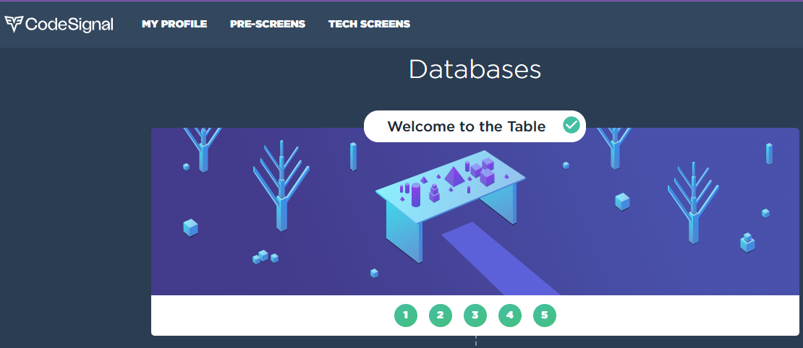

# 📖 SQL on CodeSignal: My Solutions & Gamified Learning 🎮

Welcome to my dedicated space for SQL challenges on CodeSignal! Dive into my solutions, learn from them, and see how gamification significantly boosts the learning process.

## 🎲 Why Gamification?

Gamification turns the learning process into an engaging journey. By facing challenges on CodeSignal, I've experienced:
- **Motivation:** Earning points and badges keeps the enthusiasm high.
- **Structured Learning:** Levels and tiers help in grasping concepts progressively.
- **Instant Feedback:** Immediate results aid in understanding mistakes and rectifying them on the spot.

## 📚 Contents:

- **Solutions:** My approaches to SQL challenges, organized for easy browsing.
- **Quick Tips:** Insights and shortcuts I've picked up, useful for swift learning.

## 🤝 Join In:

Got alternative solutions or insights? Share them! Let's foster a community of SQL learners and enthusiasts.

---

**Let's game on and code on!** 🎉🎮🔍
